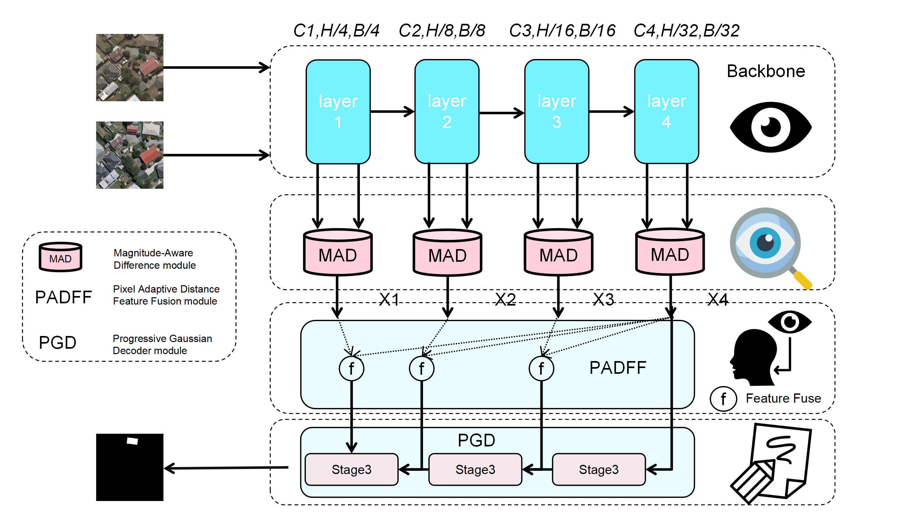

# FDDNet: Focus on Differences, Discover Changes

[](https://www.python.org/)
[](https://pytorch.org/)
[](LICENSE)

## 📖 Introduction

FDDNet (Focus on Differences, Discover Changes) is a deep learning model for remote sensing image change detection. The model focuses on difference regions to discover changes, featuring an innovative architecture design including  Magnitude-Aware Difference (MAD) module, Pixel Adaptive Distance Feature Fusion module, and Progressive Gaussian Decoder.



## 🎯 Key Features

- **MAD Module (Magnitude-based Adaptive Difference Enhancement)**: Adaptively amplifies significant differences through nonlinear functions, helping the model focus on real change regions
- **Pixel-level Adaptive Feature Fusion (PixelAdaptiveDistanceSSFF)**: Computes optimal fusion weights for each pixel, achieving fine-grained multi-scale feature fusion
- **Progressive Gaussian Diffusion Decoder**: Mimics the denoising process of diffusion models, progressively recovering from coarse to fine features, avoiding feature loss from direct fusion
- **Multiple Backbone Support**: Supports various backbone networks including VGG11, ResNet18, and DenseNet121
- **Lightweight Design**: Moderate parameter count with fast inference speed

## 📦 Installation

### Requirements

- Python >= 3.7
- PyTorch >= 2.2.1
- CUDA >= 12.1 (if using GPU)

### Installation Steps

1. Clone the repository:
```bash
git clone https://github.com/yourusername/FDDNet.git
cd FDDNet
```

2. Install dependencies:
```bash
pip install -r requirements.txt
```

### Dependencies

Main dependencies (see `requirements.txt` for details):
- `torch>=2.2.1+cu121`: PyTorch deep learning framework
- `torchvision>=0.17.1+cu121`: Computer vision utilities
- `timm>=0.6.7`: Pre-trained model library
- `numpy>=1.26.4`: Numerical computing library
- `PIL>=10.2.0`: Image processing library
- `sklearn>=1.4.2`: Machine learning utilities
- `fvcore>=0.1.5.post20221221`: Model analysis tools

## 🚀 Usage

### Test Model with `test_model.py`

The `test_model.py` script is the main tool for testing and evaluating the FDDNet model on datasets.


#### All Available Arguments

```bash
python test_model.py \
    --backbone {vgg11,resnet18,densenet121} \  # Backbone network (default: vgg11)
    --num_class 2 \                              # Number of output classes (default: 2)
    --pretrained \                               # Use pretrained backbone weights
    --checkpoint path/to/checkpoint.ckpt \       # Path to checkpoint file (optional)
    --dataset {dummy,custom,folder} \            # Dataset type (default: folder)
    --data_root /path/to/dataset \              # Dataset root directory (required for custom/folder)
    --imgA_dir image1 \                         # Directory name for time A images (default: image1)
    --imgB_dir image2 \                         # Directory name for time B images (default: image2)
    --label_dir label \                         # Directory name for labels (default: label, optional for folder)
    --num_samples 10 \                          # Number of samples for dummy dataset (default: 10)
    --img_size 256 \                            # Input image size, None to keep original (default: None)
    --batch_size 2 \                            # Batch size (default: 2)
    --num_batches None \                        # Number of batches to test, None for all (default: None)
    --num_workers 4 \                           # Number of data loading workers (default: 4)
    --device {auto,cpu,cuda}                    # Device to use (default: auto)
```

#### Dataset Types

- **`dummy`**: Synthetic dataset for quick testing. No real data needed.
- **`custom`**: Real dataset with ground truth labels. Requires `--data_root`, `--imgA_dir`, `--imgB_dir`, and `--label_dir`.
- **`folder`**: Test all images in a folder. Labels are optional. If labels exist, metrics will be calculated.

#### Output Metrics

When labels are available, the script outputs:
- **Pixel Accuracy**: Overall classification accuracy
- **Precision**: Precision score for change detection
- **Recall**: Recall score for change detection
- **F1 Score**: F1 score (harmonic mean of precision and recall)
- **IoU**: Intersection over Union for change pixels
- **Confusion Matrix**: Detailed confusion matrix (TN, FP, FN, TP)
- **FPS**: Frames per second (inference speed)
- **Average inference time**: Time per sample in milliseconds

## 📊 Dataset Format

The dataset should be organized in the following structure:

```
dataset_root/
├── image1/          # Time A images
│   ├── img1.jpg
│   ├── img2.jpg
│   └── ...
├── image2/          # Time B images
│   ├── img1.jpg
│   ├── img2.jpg
│   └── ...
└── label/           # Change detection labels (optional, for training/evaluation)
    ├── img1.png
    ├── img2.png
    └── ...
```

**Important notes:**
- Image filenames in `image1` and `image2` must correspond one-to-one
- Label images should be binary images (0=no change, 1=change)
- The `label` folder is optional if you only need inference

## 📥 Pre-trained Models

Pre-trained model weights are available for download via Google Drive:

🔗 **[Download Pre-trained Model Weights](https://drive.google.com/drive/folders/13HOrmdQp1Tf9mXg7c1Du_DE5wcEB5D1P?usp=drive_link)**

**Note:** Currently, only VGG11 backbone weights are available. The weights are trained on multiple datasets and can be used for inference.

After downloading, use the `--checkpoint` argument to load the weights:

```bash
python test_model.py \
    --backbone vgg11 \
    --checkpoint path/to/downloaded/checkpoint.ckpt \
    --dataset custom \
    --data_root /path/to/your/dataset
```

## 🔧 Model Configuration

### Backbone Selection

Default channel lists for different backbones:

| Backbone | Channel List | Characteristics |
|----------|--------------|-----------------|
| ResNet18 | [64, 128, 256, 512] | Balanced performance and speed |
| VGG11 | [256, 512, 512, 512] | Classic architecture, stable |
| DenseNet121 | [256, 512, 1024, 1024] | Rich features, larger parameters |

## 📈 Performance

Performance comparison between FDDNet and baseline methods across three datasets:

### WHU-CD Dataset

| Method | F1 | Precision | Recall | IoU | OA |
|--------|----|-----------|--------|-----|-----|
| DenseNet121+Basenet | 90.48 | 91.11 | 89.85 | 82.61 | 99.13 |
| DenseNet121+FDDNet (ours) | 91.01 | 92.56 | 89.51 | 83.50 | 99.19 |
| ResNet18+Basenet | 90.00 | 90.56 | 89.46 | 81.82 | 99.09 |
| ResNet18+FDDNet (ours) | 91.23 | 93.11 | 89.42 | 83.87 | 99.21 |
| VGG11+Basenet | 92.29 | 95.08 | 89.66 | 85.68 | 99.31 |
| **VGG11+FDDNet (ours)** | **93.12** | **94.75** | **91.55** | **87.13** | **99.38** |

### LEVIR-CD Dataset

| Method | F1 | Precision | Recall | IoU | OA |
|--------|----|-----------|--------|-----|-----|
| DenseNet121+Basenet | 90.67 | 91.93 | 89.44 | 82.93 | 99.06 |
| DenseNet121+FDDNet (ours) | 90.62 | 91.28 | 89.97 | 82.85 | 99.05 |
| ResNet18+Basenet | 90.24 | 91.51 | 89.01 | 82.22 | 99.02 |
| ResNet18+FDDNet (ours) | 91.17 | 90.57 | 89.99 | 82.77 | 99.05 |
| VGG11+Basenet | 91.28 | 91.64 | 90.92 | 83.96 | 99.11 |
| **VGG11+FDDNet (ours)** | **91.21** | **91.91** | **90.51** | **83.83** | **99.11** |

### CLCD Dataset

| Method | F1 | Precision | Recall | IoU | OA |
|--------|----|-----------|--------|-----|-----|
| DenseNet121+Basenet | 75.87 | 76.49 | 75.27 | 61.12 | 96.44 |
| DenseNet121+FDDNet (ours) | 78.18 | 79.65 | 76.75 | 64.17 | 96.81 |
| ResNet18+Basenet | 74.69 | 76.87 | 72.62 | 59.60 | 96.34 |
| ResNet18+FDDNet (ours) | 77.41 | 79.60 | 75.34 | 63.15 | 96.73 |
| VGG11+Basenet | 75.19 | 79.25 | 71.52 | 60.24 | 96.49 |
| **VGG11+FDDNet (ours)** | **77.59** | **82.00** | **73.62** | **63.38** | **96.83** |

*Note: All metrics are in percentage. OA stands for Overall Accuracy. Bold values indicate our FDDNet method with VGG11 backbone.*

## 📝 Project Structure

```
FDDNet/
├── FDDNet.py                      # FDDNet model definition
├── backbone.py                    # Backbone network definition
├── build_model.py                 # Model building utilities
├── change_detection_dataset.py    # Dataset loader
├── test_model.py                  # Model testing script
├── generate_requirements.py     # Requirements generation script
├── requirements.txt               # Dependencies list
├── FDDNet.png                     # Model architecture diagram
└── README.md                      # This file
```

## 🤝 Contributing

Contributions are welcome! Please feel free to submit Issues and Pull Requests.

## 📄 License

This project is licensed under the MIT License. See the [LICENSE](LICENSE) file for details.

## 📧 Contact

For questions or suggestions, please contact:
- Submit an Issue
- Email: [052922104.szut.edu.cn]

## 🙏 Acknowledgments

Thanks to the following open-source projects:
- [PyTorch](https://pytorch.org/)
- [timm](https://github.com/rwightman/pytorch-image-models)

---

**FDDNet: Focus on Differences, Discover Changes**


